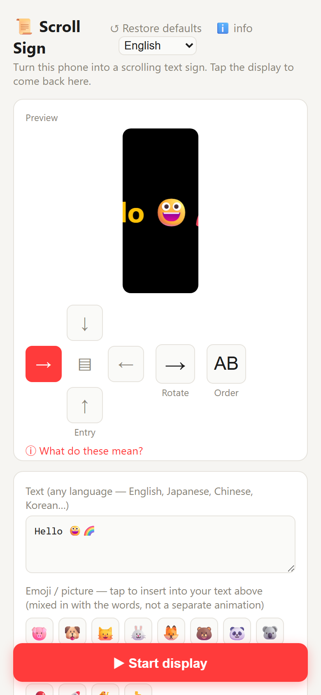
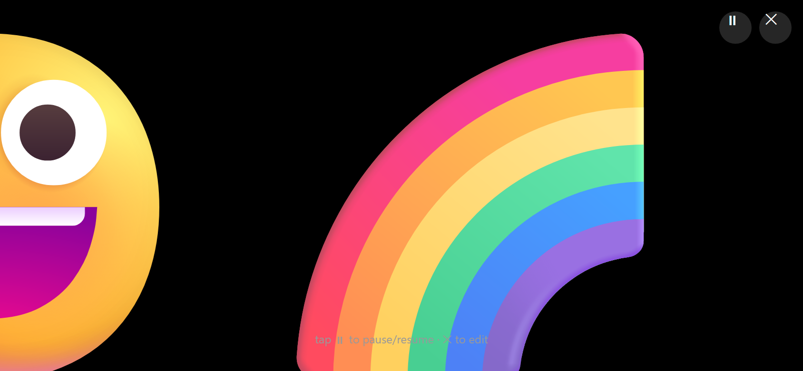
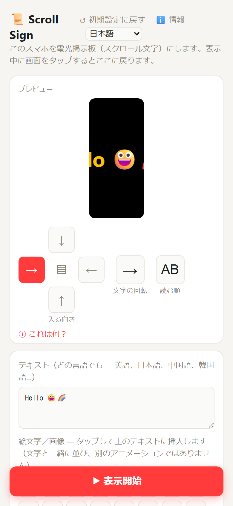
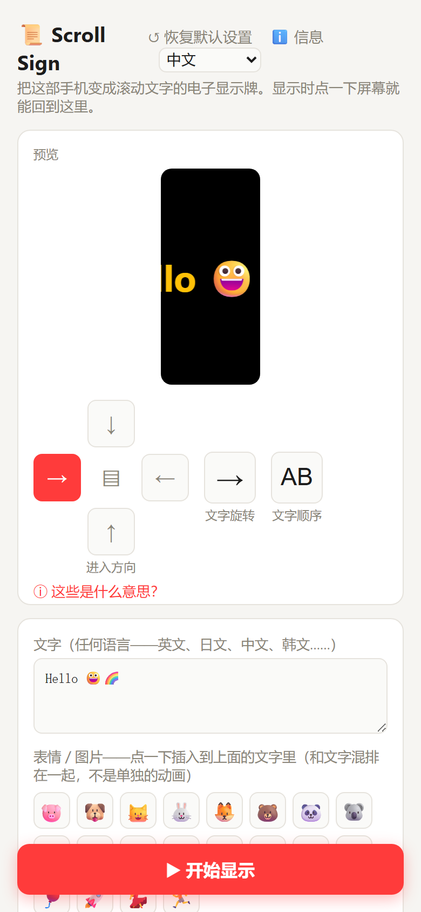

# Scroll Sign

A full-screen scrolling-text (LED marquee) sign that runs in your phone's browser —
no install, no sign-up. Turn several phones lying side by side into **one big scrolling display**.

**Live:** https://sign.maysuns.uk
More tools: https://maysuns.uk

## Screenshots

| Editor | Full-screen display (landscape) |
|---|---|
|  |  |

| Japanese UI | Chinese UI |
|---|---|
|  |  |

## Languages

The interface is English by default and also available in Japanese and Simplified Chinese.
Use the language selector at the top right, or open `?lang=ja` / `?lang=zh` (the browser language is used the first time).
All translations live in `public/i18n.js` (English text -> Japanese / Chinese); the English text in `public/index.html` is the source.

## Features

- Any text (CJK / Latin / emoji mixed), adjustable size, speed, color, font, rainbow text
- Horizontal or vertical scrolling, 4 directions, text rotation as a separate control
- Inline pictures inside the scrolling text, optional moving mascot emoji
- Live preview strip while you edit; tap to pause/resume; real fullscreen
- Installable PWA, works offline after the first load
- **Multi-phone wall:** one controller phone discovers the other phones, numbers them,
  sets the shared text/settings and a common start time, then starts them all together.
  Each phone shows its own slice, so the row of phones reads as one wide screen.
  Clocks are aligned against the server time to keep the phones in sync.

## Structure

```
public/   the whole app — static (index.html, manifest.json, sw.js, icons); no build step
server/   tiny WebSocket signaling server (Node + ws) used only by the multi-phone mode
```

## Run locally

```bash
cd public && python -m http.server 8879     # single-phone mode, open http://localhost:8879
cd server && npm install && node server.js  # optional: multi-phone signaling (see server.js for the port)
```

Serve `public/` over HTTPS to get "Add to Home Screen" and offline support. For multi-phone
mode, reverse-proxy `/ws/` on the same host to the signaling server.

## Honest limitations

- Multi-phone sync accuracy depends on each device's clock and network latency; expect small
  drift on long runs — restart from the controller to re-align.
- Not yet tested on a large number of real phones.
- On iOS Safari the Fullscreen API is mostly unavailable; the page falls back to filling the viewport.

## License

MIT
